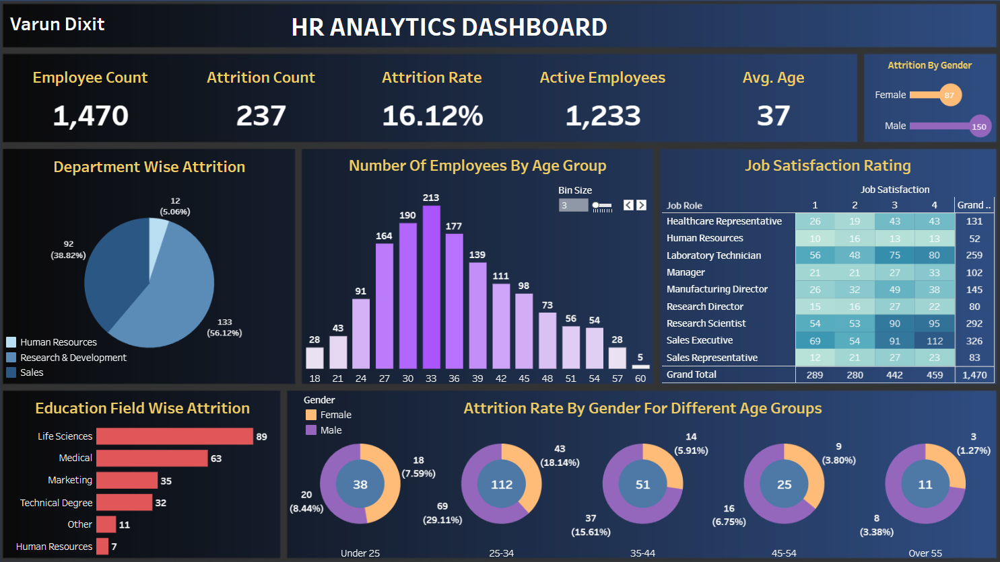

<h1>HR Analytics</h1>

The HR Analytics project dives deep into the intricate patterns of employee attrition, meticulously dissecting every possible factor that drives individuals to leave the company. It doesn't just track the number of exits; it unravels the complex tapestry of attrition, analyzing it through the lenses of gender, education, age, and countless other demographic nuances. This project is like an investigative masterpiece, revealing the hidden forces that shape employee turnover, offering an unparalleled, comprehensive view of why people leave, and how these departures are influenced by a web of interconnected personal and professional factors. This Project consists of various dashboards made on various platforms, namely Tableau and PowerBI. The dashboards are made from hypothetical problem statement gathered from the HR department of a certain company. The PPT of the problem statement can be found <a href='./Problem_Statement.pdf'>here</a>. The Dataset was collected from Kaggle and the csv file for it can be found <a href='./HR-Employee-Attrition_Dataset.csv'>here</a>.
 
<h2>Tableau</h2>

To view the HR Analytics Tableau Dashboard, click <a href='https://public.tableau.com/views/HRAnalytics_16882341820020/HRAnalyticsDashboard?:language=en-US&publish=yes&:display_count=n&:origin=viz_share_link'>here</a>.
 

<h2>PowerBI</h2>

To view the HR Analytics PowerBI Dashboard, click <a href='./HR_Analytics.pdf'>here</a> or download the pbix file <a href='./HR_Analytics.pbix'>here</a>.
 

