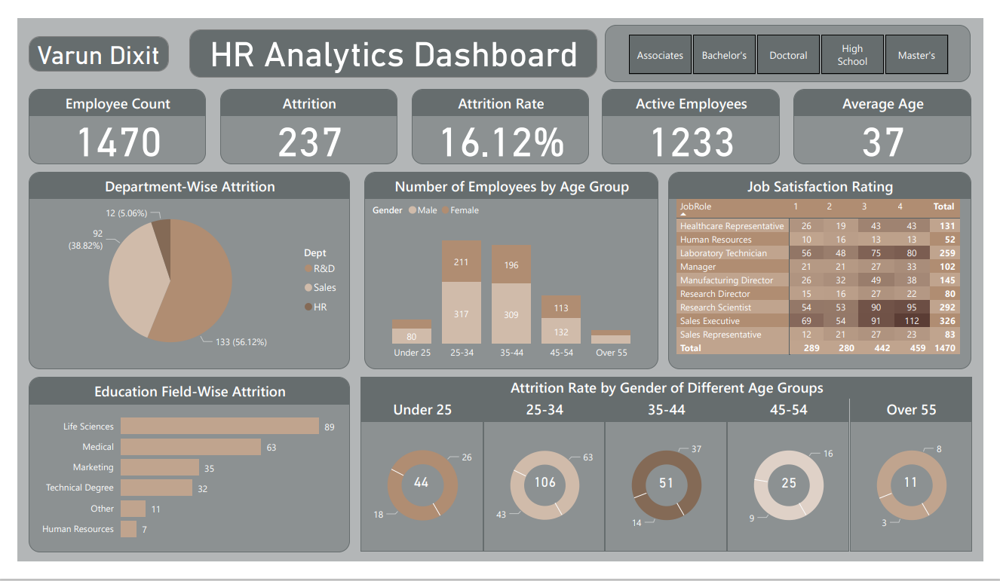

<h1>HR Analytics</h1>

The HR Analytics project analyses the 'Attrition' or the number of employees that leave the company and the specifics of the attrition with respect to gender, education, age, etc. This Project consists of various dashboards made on various platforms, namely Tableau, PowerBI and Excel. The dashboards are made from hypothetical problem statement gathered from the HR department of a certain company. The PPT of the problem statement can be found <a href='./Problem_Statement.pdf'>here</a>. The Dataset was collected from Kaggle and the csv file for it can be found <a href='./HR-Employee-Attrition_Dataset.csv'>here</a>.
 
<h2>Tableau</h2>

To view the HR Analytics Tableau Dashboard, click <a href='https://public.tableau.com/views/HRAnalytics_16882341820020/HRAnalyticsDashboard?:language=en-US&publish=yes&:display_count=n&:origin=viz_share_link'>here</a>.
 

<h2>PowerBI</h2>

To view the HR Analytics PowerBI Dashboard, click <a href='./HR_Analytics.pdf'>here</a> or download the pbix file <a href='./HR_Analytics.pbix'>here</a>.
 

<h2>Excel</h2>

 

